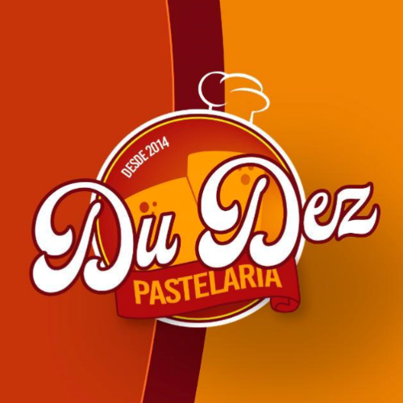

# 🍽️ Du Dez Pastelaria - Menu Digital

<div align="center">
  
  
  **Os melhores pastéis e pizzas da cidade, agora no seu celular!**
  
  [](https://du-dez-pastelaria.vercel.app)
  [](https://wa.me/5585991993833)
  [](https://reactjs.org/)
  [](https://www.typescriptlang.org/)
</div>

---

## 🚀 **Sobre o Projeto**

Sistema de **menu digital** moderno e responsivo para a **Du Dez Pastelaria**, desenvolvido para facilitar pedidos online via WhatsApp. O projeto oferece uma experiência completa de delivery com interface intuitiva e processo de pedido otimizado.

### 🌐 **Acesse o Sistema**

**Link do Projeto:** [du-dez-pastelaria.vercel.app](https://du-dez-pastelaria.vercel.app)

---

## ✨ **Funcionalidades Principais**

### 🛒 **Sistema de Pedidos**

- **Menu digital completo** com mais de 70 produtos
- **Carrinho inteligente** com controle de quantidade
- **Adicionais personalizáveis** para pastéis
- **Categorização organizada** (Pastéis Salgados, Doces, Pizzas, Batatas, Bebidas)

### 💳 **Formas de Pagamento**

- **PIX** - Pagamento instantâneo
- **Cartão** - Débito e Crédito
- **Dinheiro** - Com calculadora automática de troco

### 📱 **Integração WhatsApp**

- **Pedidos automáticos** via WhatsApp
- **Mensagens profissionais** formatadas
- **Detalhamento completo** do pedido
- **Informações organizadas** por categoria

### 🚚 **Opções de Entrega**

- **Delivery** - Entrega no endereço
- **Retirada** - Buscar na loja
- **Formulário completo** de dados do cliente

---

## 🛠️ **Tecnologias Utilizadas**

### **Frontend**

- **React 18** - Biblioteca JavaScript
- **TypeScript** - Tipagem estática
- **Vite** - Build tool moderna
- **Tailwind CSS** - Framework CSS utilitário

### **Componentes UI**

- **Shadcn/ui** - Componentes acessíveis
- **Radix UI** - Primitivos de interface
- **Lucide React** - Ícones modernos

### **Funcionalidades**

- **React Hooks** - Gerenciamento de estado
- **Responsive Design** - Adaptável a todos os dispositivos
- **PWA Ready** - Instalável como app

---

## 📋 **Cardápio Completo**

### 🥟 **Pastéis Salgados** (40+ opções)

- Tradicionais (Queijo, Carne, Frango)
- Especiais (Mistão, Portuguesa, Carne do Sol)
- Gourmet (Com Catupiry, Cheddar, Bacon)

### 🍰 **Pastéis Doces** (3 opções)

- Chocolate
- Chocolate com Queijo
- Sonho de Valsa

### 🍕 **Pizzas** (20+ sabores)

- Salgadas (Calabresa, Portuguesa, Frango)
- Especiais (Carne do Sol Premium, A Moda da Casa)
- Doces (Brigadeiro, M&Ms)

### 🍟 **Batatas**

- Tradicional 300g
- Com Cheddar e Bacon 300g

### 🥤 **Bebidas**

- Sucos 300ml
- Refrigerantes (Lata e 1L)
- Cajuína 1L

---

## 🚀 **Como Executar o Projeto**

### **Pré-requisitos**

- Node.js 18+ instalado
- npm ou yarn

### **Instalação**

```bash
# Clone o repositório
git clone https://github.com/Ronald-silva/dez-pastel-delivery.git

# Entre no diretório
cd dez-pastel-delivery

# Instale as dependências
npm install

# Execute o projeto
npm run dev
```

### **Scripts Disponíveis**

```bash
npm run dev      # Servidor de desenvolvimento
npm run build    # Build para produção
npm run preview  # Preview do build
npm run lint     # Verificar código
```

---

## 📱 **Como Fazer Pedidos**

1. **Acesse** [du-dez-pastelaria.vercel.app](https://du-dez-pastelaria.vercel.app)
2. **Navegue** pelo menu e adicione itens ao carrinho
3. **Personalize** com adicionais (se disponível)
4. **Preencha** seus dados e endereço
5. **Escolha** a forma de pagamento
6. **Envie** o pedido via WhatsApp automaticamente

---

## 🎨 **Design e UX**

### **Interface Moderna**

- Design limpo e profissional
- Cores da marca (Laranja #f97316)
- Tipografia legível
- Navegação intuitiva

### **Experiência Mobile-First**

- Otimizado para smartphones
- Touch-friendly
- Carregamento rápido
- Offline-ready

### **Identidade Visual**

- **Paleta de cores** baseada na logo oficial
- **Laranja vibrante** (#FF8C00) como cor principal
- **Vermelho bordô** (#B22222) para contrastes
- **Dourado** (#FFD700) para destaques especiais
- **Gradientes harmoniosos** entre as cores da marca

### **Acessibilidade**

- Contraste adequado
- Navegação por teclado
- Screen reader friendly
- Componentes semânticos

---

## 📊 **Métricas do Projeto**

- **70+ produtos** no cardápio
- **5 categorias** organizadas
- **12+ adicionais** disponíveis
- **3 formas de pagamento**
- **100% responsivo**
- **PWA compliant**

---

## 🔧 **Configurações**

### **WhatsApp**

- Número configurado: `85991993833`
- Mensagens automáticas formatadas
- Integração direta via wa.me

### **Deploy**

- Hospedado na **Vercel**
- Deploy automático via Git
- SSL/HTTPS habilitado
- CDN global

---

## 📈 **Próximas Funcionalidades**

- [ ] Sistema de avaliações
- [ ] Programa de fidelidade
- [ ] Notificações push
- [ ] Histórico de pedidos
- [ ] Cupons de desconto
- [ ] Integração com delivery apps

---

## 🤝 **Contribuição**

Contribuições são bem-vindas! Para contribuir:

1. Fork o projeto
2. Crie uma branch (`git checkout -b feature/nova-funcionalidade`)
3. Commit suas mudanças (`git commit -m 'Adiciona nova funcionalidade'`)
4. Push para a branch (`git push origin feature/nova-funcionalidade`)
5. Abra um Pull Request

---

## 📄 **Licença**

Este projeto está sob a licença MIT. Veja o arquivo [LICENSE](LICENSE) para mais detalhes.

---

## 👨‍💻 **Desenvolvido por**

<div align="center">
  
### **Ronald Digital**
**Desenvolvimento Web & Soluções Digitais**

[](https://ronalddigital.dev)
[](https://linkedin.com/in/ronald-silva-dev)
[](https://github.com/Ronald-silva)
[](https://wa.me/5585991575525)

**Especialista em:**

- ⚛️ React & Next.js
- 🎨 UI/UX Design
- 📱 Aplicações Mobile
- 🚀 Soluções Digitais para Negócios

</div>

---

## 🏪 **Sobre a Du Dez Pastelaria**

A **Du Dez Pastelaria** é referência em pastéis e pizzas, oferecendo produtos de alta qualidade com ingredientes frescos e sabor incomparável. Com este menu digital, a experiência do cliente foi elevada a um novo patamar de praticidade e eficiência.

### **Contato da Pastelaria**

- 📱 **WhatsApp:** (85) 99199-3833
- 🌐 **Site:** [du-dez-pastelaria.vercel.app](https://du-dez-pastelaria.vercel.app)

---

<div align="center">
  
**⭐ Se este projeto foi útil, deixe uma estrela no repositório!**

**Desenvolvido com ❤️ por [Ronald Digital](https://ronalddigital.dev)**

</div>
